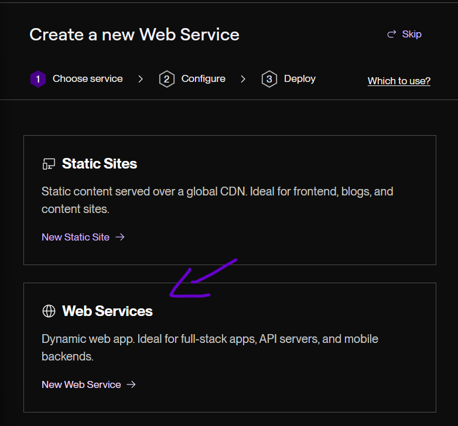
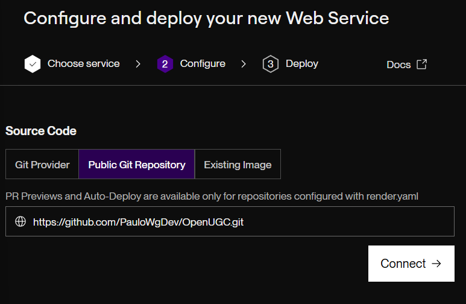

# Host OpenUGC with Render

In this guide, you’ll learn how to host the **OpenUGC API** on Render, link your repository, and configure the required environment variables.  
It’s one of the fastest ways to get OpenUGC up and running with a live URL.

---

### 1. Create a New Web Service

From the Render dashboard, click on **“New +” → “Web Service”**.

---

### 2. Link your repository with Render

Paste the following repo URL into the **Public Git Repository** field: `https://github.com/PauloWgDev/OpenUGC.git`

---

### 3. Configure the API values

Fill in the fields as follows:

- **Language**: Docker  
- **Branch**: `master` (or `development` if you want the dev version)  
- **Region**: Any (pick the closest to your users)  
- **Root Directory**: leave empty
- **Instance Type**: Free (recommended for first-time setup)
- **Environment Variables**: configure in the next step

---

### 4. Set Up environment variables

OpenUGC requires a few environment variables to connect to your database and storage.

The name of these environment variables must match those defined in [application.properties](https://github.com/PauloWgDev/OpenUGC/blob/development/src/main/resources/application.properties)

| Variable              | Description                                              | Example                                |
|-----------------------|----------------------------------------------------------|----------------------------------------|
| `DATABASE_URL`        | JDBC connection string for PostgreSQL                   | `jdbc:postgresql://host:5432/dbname`   |
| `DATABASE_USERNAME`   | PostgreSQL username                                     | `postgres`                             |
| `DATABASE_PASSWORD`   | PostgreSQL password                                     | `mypassword`                           |
| `DATABASE_PROFILE`    | Which database are you using (postgres, mysql, etc)     | `postgres`                             |
| `PORT`                | Port where the API runs (Render defaults to `10000`)    | `8080`                                 |
| `JWT_SECRET`          | Secret key for signing JWT tokens (must be at least 32 bytes long) | `aSecureRandomGeneratedKeyThatIsAtLeast32BytesLong!`  |
| `STORAGE_TYPE`        | Storage backend: `local` or `cloud`                     | `cloud`                                |
| `STORAGE_LOCATION`    | (Local only) Path where files are stored, , if using cloud leave as 'not_using'   | `/data/ugc`   |
| `STORAGE_BASEURL`     | (Local only) Base URL for serving stored files, if using cloud leave as 'not_using'         | `http://localhost:8080/files/` |
| `CLOUD_BUCKET`        | (Cloud only) Cloud storage bucket name                | `openugc-bucket`    |
| `CLOUD_BASEURL`       | (Cloud only) Public base URL for cloud files            | `https://storage.googleapis.com/openugc-bucket/`   |
| `GOOGLE_APPLICATION_CREDENTIALS` | (Google CLoud only) path to where the google credentials are stored | `/etc/secrets/arched-sorter-459106-f6-621d3319234e.json` |

> **Important**: Make sure your database and storage are accessible from Render. If you use Render’s PostgreSQL service, it will give you a `DATABASE_URL` automatically.

---

After saving your settings, Render will build and deploy OpenUGC. (On the free version it may take a few minutes to deploy)

Once the build is finished, you’ll have a public URL where your API is live! 🎉