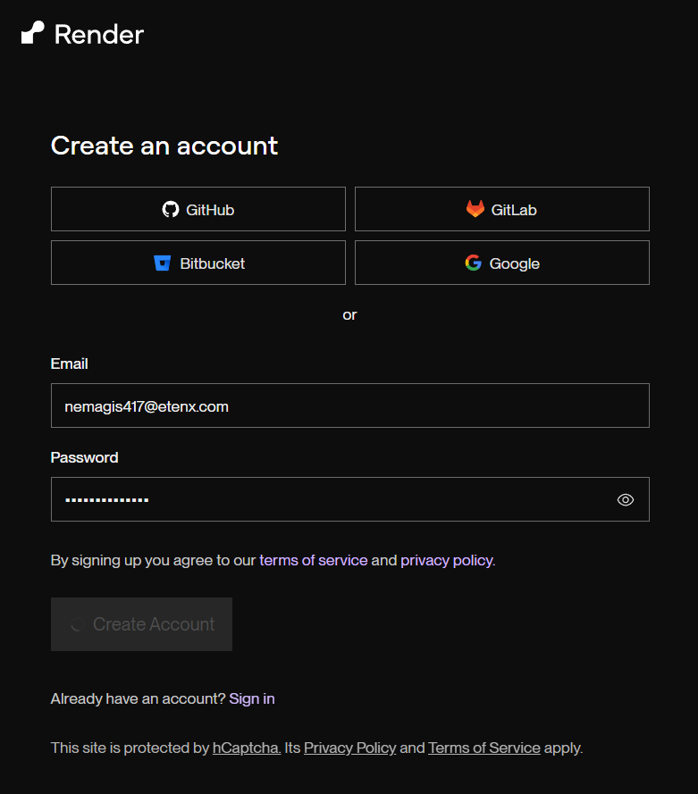
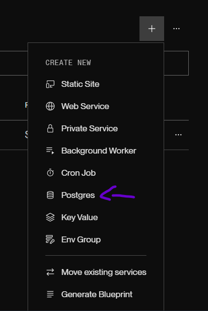

# Host Database with Render

[Render](https://render.com/) is a cloud service that allows you to host your APIs and databases with minimal setup.  
It offers a free tier, which makes it a great option for trying out OpenUGC with cloud services.  

In this guide, we’ll walk you through how to create and configure your **Database** on Render.

---

### 1. Create an Account

Go to [render.com](https://render.com/) and sign up for a free account.

---

### 2. Create a New Web Service

From the Render dashboard, click on **“New +” → “Postgres”**.

### 3. Configure Postgres

Fill in the fields.

- **Region**: Any (closer to your users)  
- **PostgreSQL Version**: 17  
- **PLan Options**: Free (recommended for first-time setup)

> 💡 You can always upgrade later for a production ready project.

---

### 3. Get the URL and Credentials

Once the database is created, on the **Connections** part, Render will provide you with the :

- **External Database URL**  
- **Username**  
- **Password**  

You’ll need these values when configuring the backend.  
Follow the steps in the [Host API](./host-api.md) section to connect OpenUGC to your new database.

